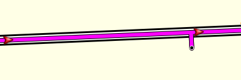

# Imported routes and tracks

Routes from external sources quite often contain points that aren't aligned with the Garmin maps.

Such routes may have mis-aligned points like this:

When navigating this route, this point will cause the device to insist on turning back to travel through the point.

To avoid this, ensure that all points on the route are aligned on the road.


