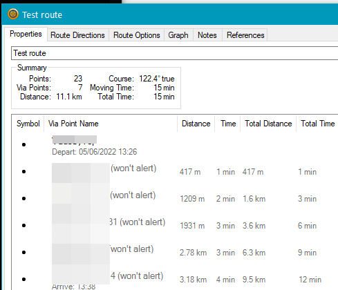
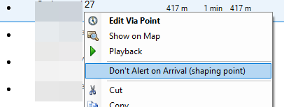

# Via points and shaping points
These are slightly different things.

* **Via points** are shown on the device screen as "Time to Via" or "distance to Via"
  and are announced visually and audibly.

  The first point in the image above of the route properties is a **Via point**.

* **Shaping points** are never shown on the device and are never announced.
  They are used to, more accurately, draw the route. They are ignored when
  missed when following an active route (i.e. the device doesn't start
  insisting you go back to pass through that point)

  The 2. and following points above (annotated "(_won't alert_)") are **Shaping points**.

  **Shaping points** can only be created by transforming **Via points**:
  * Open the route properties (double click the route or right click and choose '_Open_')
  * Select the point(s) to transform
  * Right click on selection
  * Select '_Don't Alert on Arrival (shaping point)_'

    

  <a href="http://creativecommons.org/licenses/by-nc-sa/3.0/" rel="license">cc by nc sa 3.0</a>
